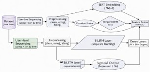
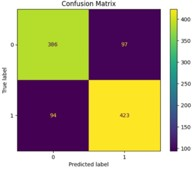
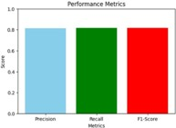

# Temporal Emotional Drift Analysis for Early Mental Health Risk Detection

## Overview

Mental health disorders such as depression often develop gradually and are reflected through subtle changes in language, emotional expression, and online behavior over time. Traditional sentiment analysis methods typically evaluate individual posts in isolation, making it difficult to capture these evolving emotional patterns.

This project introduces a **Temporal Emotional Drift Analysis** framework designed to detect early signs of mental health risks by analyzing the progression of emotions across a sequence of user-generated texts. By combining contextual language representations from **BERT**, sentiment analysis, temporal emotional drift modeling, and **BiLSTM-based sequence learning**, the framework identifies behavioral trends that may indicate depression or psychological distress.

The proposed approach focuses not only on what users express at a given moment but also on how their emotional state changes over time, enabling more effective early risk detection.

## Architecture

## Model Performance

## Key Features

* **Temporal Emotional Drift Detection** to measure emotional changes across consecutive posts
* **BERT Contextual Embeddings** for capturing semantic and contextual information
* **Sentiment Analysis** for extracting emotional polarity and intensity
* **BiLSTM Sequence Modeling** for learning temporal dependencies in user behavior
* **Early Mental Health Risk Prediction** using longitudinal emotional patterns
* **Longitudinal User Behavior Analysis** across multiple time periods
* **Feature Fusion Framework** combining semantic, sentiment, and temporal signals
* **Scalable NLP Pipeline** suitable for social media and conversational datasets

## Methodology

### 1. Data Collection and Temporal Structuring

Social media posts are collected and grouped by user. Posts are then arranged chronologically to preserve temporal relationships and emotional progression.

### 2. Text Preprocessing

The textual data undergoes preprocessing steps including:

* Lowercasing
* Removal of URLs and special characters
* Tokenization
* Handling missing values
* Text normalization

### 3. BERT Embedding Generation

Each post is transformed into contextual embeddings using a pre-trained BERT model. These embeddings capture semantic meaning and contextual relationships beyond traditional bag-of-words representations.

### 4. Sentiment Score Extraction

Sentiment scores are generated using TextBlob to quantify emotional polarity and subjectivity for each post.

### 5. Emotional Drift Calculation

Temporal emotional drift is computed by measuring changes in sentiment and contextual representations between consecutive posts. This helps identify gradual emotional deterioration or improvement over time.

### 6. BiLSTM Sequence Learning

Sequences of embeddings and emotional drift features are fed into a Bidirectional Long Short-Term Memory (BiLSTM) network. The model learns temporal dependencies and behavioral trends across user timelines.

### 7. Mental Health Risk Classification

The learned temporal representations are used to classify users into:

* Depression Risk
* Non-Depression Risk

The final prediction is based on both current emotional state and historical emotional evolution.

## Technologies Used

* **Python**
* **Natural Language Processing (NLP)**
* **TensorFlow / Keras**
* **BERT**
* **BiLSTM**
* **TextBlob**
* **Pandas**
* **NumPy**
* **Scikit-learn**
* **Matplotlib**
* **Jupyter Notebook**

## Dataset

This project utilizes a publicly available depression detection dataset from Kaggle:

🔗 **Dataset Link:**
https://www.kaggle.com/datasets/infamouscoder/depression-reddit-cleaned

### Dataset Characteristics

* Approximately **5,000+ social media posts**
* Binary classification labels:

  * Depression
  * Non-Depression
* User-generated textual content
* Suitable for sentiment and mental health analysis
* Adapted for temporal grouping and sequence modeling

### Data Preparation

To support temporal emotional drift analysis:

1. Posts are grouped by user.
2. User posts are arranged chronologically.
3. Temporal sequences are generated for each user.
4. Sentiment and contextual features are extracted.
5. Sequential data is prepared for BiLSTM training.

## Results

The proposed framework demonstrates promising performance for early mental health risk detection.

| Metric    | Score |
| --------- | ----- |
| Precision | 0.81  |
| Recall    | 0.82  |
| F1 Score  | 0.82  |

### Key Observations

* Temporal modeling improves detection compared to isolated sentiment analysis.
* Emotional drift features provide valuable indicators of psychological changes.
* BERT embeddings enhance contextual understanding of user expressions.
* BiLSTM effectively captures long-term emotional trends and behavioral patterns.

## Future Work

* Incorporate transformer-based temporal architectures.
* Explore multimodal mental health analysis using text, images, and behavioral signals.
* Integrate real-time monitoring systems for early intervention.
* Evaluate the framework on larger and more diverse datasets.
* Investigate explainable AI techniques for transparent mental health predictions.

## Authors

**Nisha S**

